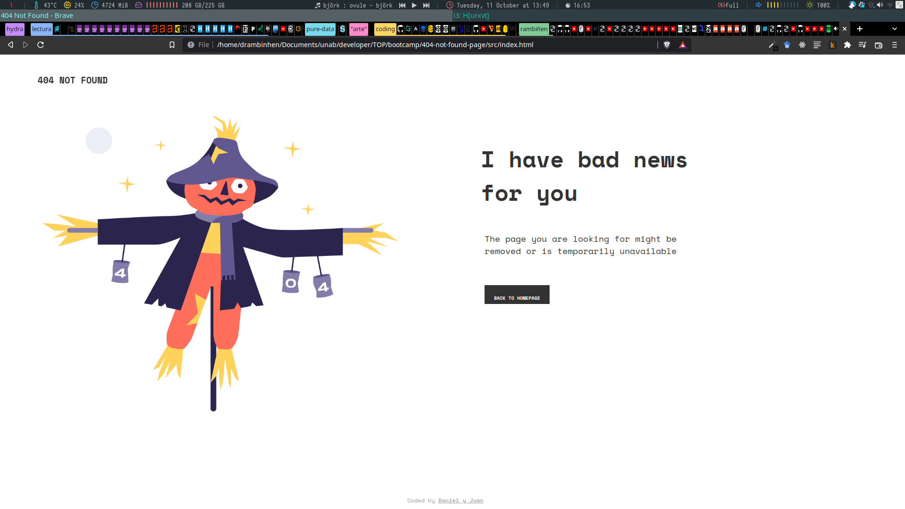
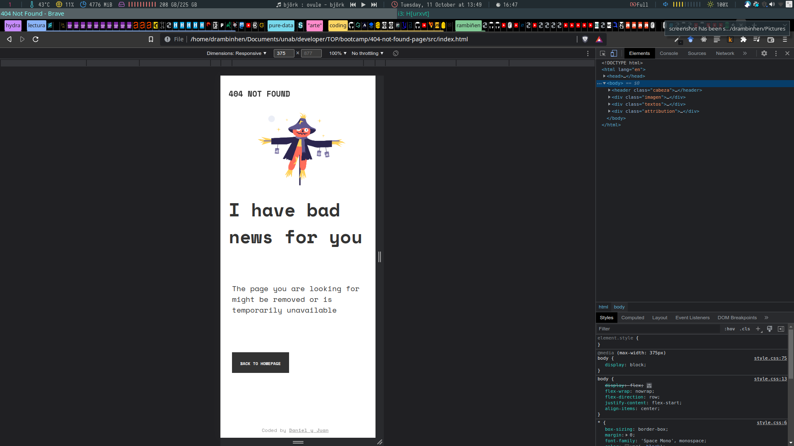

# Make It Real - 404 NOT FOUND PROJECT

This is a solution to the 404-Not-Found project of the Make It Real course.

## Table of contents

- [Overview](#overview)
  - [The challenge](#the-challenge)
  - [Screenshot](#screenshot)
- [My process](#my-process)
  - [Built with](#built-with)
  - [What I learned](#what-i-learned)
  - [Continued development](#continued-development)
  - [Useful resources](#useful-resources)
- [Author](#author)
- [Acknowledgments](#acknowledgments)

## Overview

### The challenge

Users should be able to:

- Create a page similar to the one of the challenge
- Do the work in pairs, using whatever they need it to develop the project

### Screenshot

## My process

### Built with

- Semantic HTML5 markup
- CSS custom properties
- Flexbox
- Mobile-first workflow

### What I learned

I learned about Mobile-first workflow, how to use better media query and started again to study css to recall all the things i have already study.

### Continued development

I want to keep studying css to get it better, I found out that I have forgot a lot of things about it and to learn a lot about media query, it has been a hard subject to me.

### Useful resources

- [Example resource 1](https://developer.mozilla.org/es/) - This helped me to recall some properties of css and how to use them.

## Author
Daniel Monsalve

## Acknowledgments

Thanks to Juan Lorza for working with me
